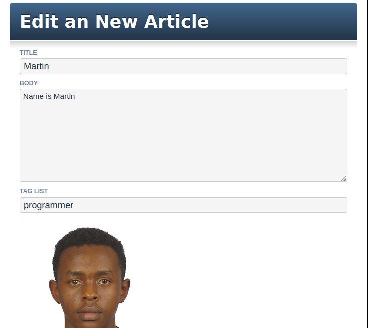

# Blogger 2
This project entails creating a simple blog system using Ruby on Rails. The scope of the project includes:

  - Models, Views, and Controllers (MVC)
  - Data Structures & Relationships
  - Routing
  - Migrations
  - Views with forms, partials, and helpers
  - RESTful design
  - Adding gems for extra features

## Built With

- Ruby on Rails
- Postgresql (production)
- Sqlite3 (development)
- Heroku
- Rubocop Linter
- Stickler CI

## Live Demo

- [Live Demo Link](https://fathomless-cliffs-29290.herokuapp.com/)

## Authors

👤 **Martin Njoroge**

- Github: [@kwizl](https://github.com/kwizl)
- Twitter: [@NjoroKaris](https://twitter.com/NjoroKaris)
- Linkedin: [martin njoroge](https://www.linkedin.com/in/martin-njoroge-098774110/)

👤 **Abdel Omar Pérez Téllez**

- Github: [abdelp](https://github.com/abdelp)
- Twitter: [@abdelperez11](https://twitter.com/abdelperez11) 
- Linkedin: [abdel-perez](https://www.linkedin.com/in/abdel-perez/)

## Show your support

Give a ⭐️ if you like this project!
